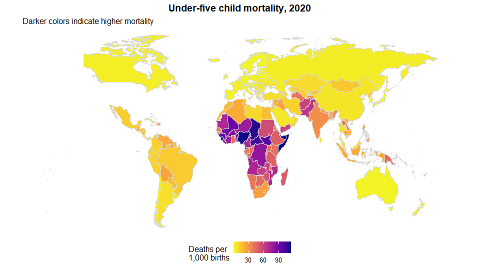
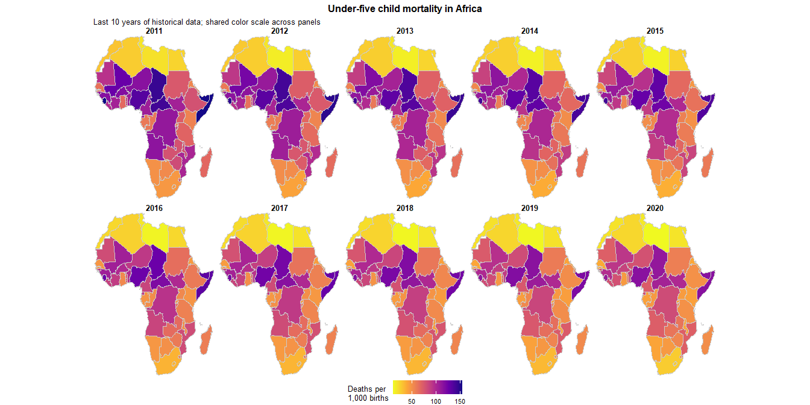
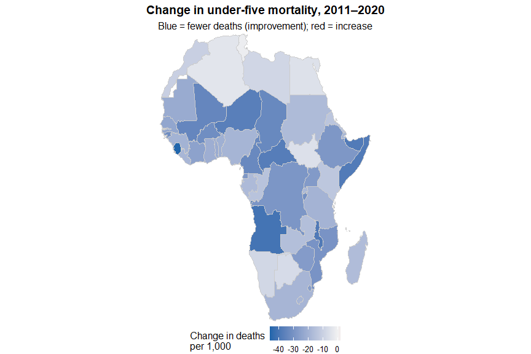
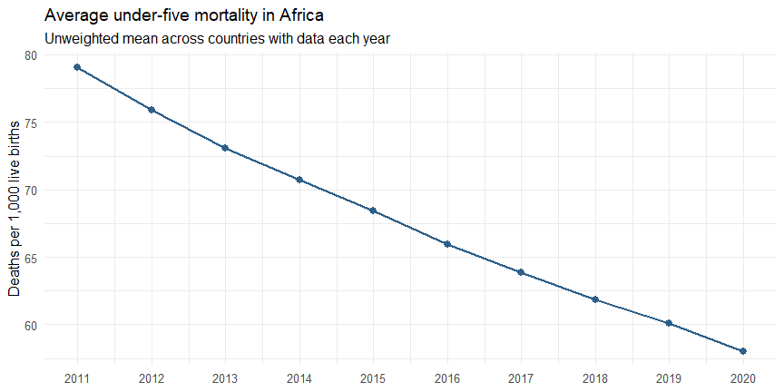
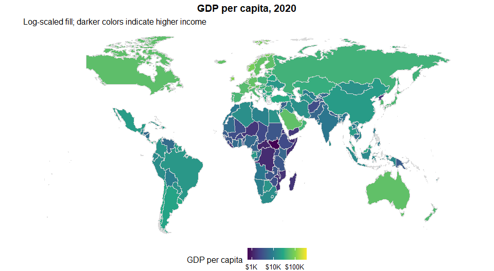
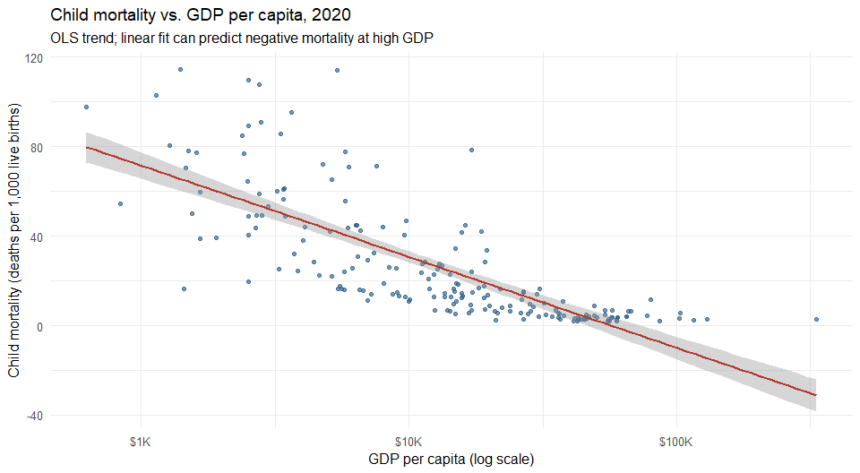
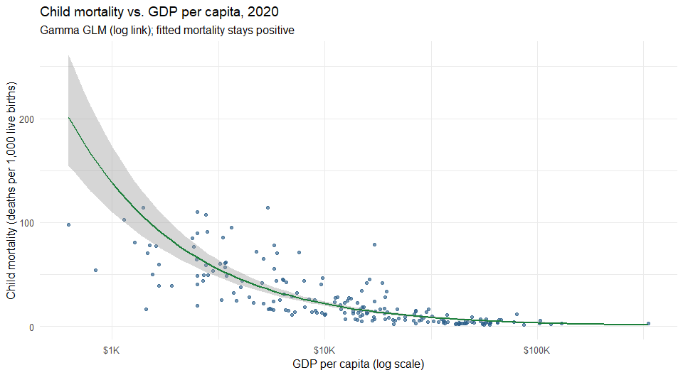

Child Mortality and GDP per Capita Analysis
================
Tamayi MLANDA
17 May 2026, 22:39 UTC

- [Introduction](#introduction)
- [Data](#data)
- [Child mortality in 2020](#child-mortality-in-2020)
- [Child mortality trend in Africa](#child-mortality-trend-in-africa)
  - [Change from 2011 to 2020](#change-from-2011-to-2020)
  - [Continental mean trend](#continental-mean-trend)
- [GDP per capita in 2020](#gdp-per-capita-in-2020)
- [Relationship between the
  indicators](#relationship-between-the-indicators)
- [Interpretation](#interpretation)
- [Reflection](#reflection)

## Introduction

This report compares two global development indicators for **2020**:
under-five child mortality (deaths per 1,000 live births) and GDP per
capita (international dollars). Each indicator is mapped worldwide, then
the two are compared on a scatterplot for countries with data on both
measures.

## Data

Sample rows from each source file:

| geo | name        |  2018 |  2019 |  2020 |  2021 |  2022 |
|:----|:------------|------:|------:|------:|------:|------:|
| afg | Afghanistan | 62.34 | 60.14 | 59.08 | 57.58 | 52.52 |
| ago | Angola      | 77.32 | 74.22 | 71.44 | 68.91 | 69.33 |
| alb | Albania     |  9.53 |  9.69 |  9.75 |  9.88 |  9.06 |
| and | Andorra     |  2.81 |  2.66 |  2.66 |  2.60 |  2.41 |
| are | UAE         |  6.99 |  6.78 |  6.58 |  6.37 |  6.10 |
| arg | Argentina   |  9.73 |  8.98 |  8.74 |  8.52 |  8.12 |

Child mortality (sample of year columns)

| geo | name        |      2018 |      2019 |      2020 |      2021 |      2022 |
|:----|:------------|----------:|----------:|----------:|----------:|----------:|
| afg | Afghanistan |  2902.392 |  2927.245 |  2769.686 |  2144.167 |  1981.710 |
| ago | Angola      |  8620.215 |  8274.543 |  7556.968 |  7408.127 |  7397.486 |
| alb | Albania     | 14710.983 | 15078.507 | 14662.796 | 16126.777 | 17111.954 |
| and | Andorra     | 63048.599 | 63215.900 | 55488.490 | 59332.203 | 63913.384 |
| are | UAE         | 68854.970 | 68887.845 | 65784.677 | 67401.121 | 68867.826 |
| arg | Argentina   | 27367.115 | 26629.553 | 23877.093 | 26300.274 | 27627.963 |

GDP per capita (sample of year columns)

In **2020**, **194** countries/territories have child mortality
estimates and **193** have GDP per capita values. **193** locations have
both indicators and are used in the scatterplot.

## Child mortality in 2020

<!-- -->

## Child mortality trend in Africa

The maps below show under-five mortality across African countries for
the most recent **10** years of historical data in the file
(**2011**–**2020**), using the same color scale in each panel so trends
are comparable.

<!-- -->

The panels above change little year to year because each map uses the
full **11**–**154** scale while typical annual shifts are only a few
deaths per 1,000. The views below summarize the same decade in ways that
make progress easier to see.

### Change from 2011 to 2020

<!-- -->

From **2011** to **2020**, **53** of **54** African countries with data
recorded lower child mortality (average decline **21** deaths per 1,000
across countries).

### Continental mean trend

<!-- -->

The continental mean fell from **79.1** in **2011** to **58** in
**2020**—a steady decline of about **2.3** deaths per 1,000 per year on
average, even though the regional map pattern stayed familiar.

## GDP per capita in 2020

<!-- -->

## Relationship between the indicators

<!-- -->

A straight-line model for mortality on log GDP can cross zero because
mortality is bounded below at 0 but OLS is not. Common ways to handle
that:

| Approach | Idea | Trade-off |
|----|----|----|
| **Clip the plot** (`coord_cartesian(ylim = c(0, NA))`) | Hide negative parts of the line | Quick; does not change the fitted model |
| **Log–log OLS** | Fit `log(mortality) ~ log(GDP)`; trend approaches 0 multiplicatively | Interpretation is on percent changes; zeros in data are a problem |
| **GLM, Gamma + log link** | Model positive mean: `E[mortality] = exp(β₀ + β₁·log GDP)` | Stays \> 0 by construction; good default for skewed positive outcomes |
| **LOESS / GAM** | Flexible curve through the cloud | Can still dip slightly at edges unless constrained or clipped |
| **No smooth** | Points only | Avoids implying impossible predictions |

The chart below uses a **Gamma GLM with log link**, which keeps the
fitted trend and confidence band strictly above zero while preserving
the same log-scaled GDP axis.

<!-- -->

## Interpretation

Countries with **higher GDP per capita** tend to have **lower under-five
mortality**. Across the **193** countries with both indicators in 2020,
the Pearson correlation on log GDP is **-0.77** and the Spearman rank
correlation is **-0.87**, indicating a strong inverse association.
Wealthier economies cluster at low mortality rates (often below 20
deaths per 1,000 births), while the highest mortality burdens are
concentrated among lower-income countries, many in sub-Saharan Africa.
The OLS trend illustrates the direction of the association but is not
appropriate for extrapolation at high incomes because it predicts
impossible negative rates; the Gamma GLM trend is better suited when
describing how mortality **approaches** zero without crossing it. The
overall pattern is clear: economic development is associated with
substantially better child survival, likely reflecting stronger health
systems, nutrition, sanitation, and maternal care.

## Reflection

It was easy to generate the script using AI. The outputs from the first
run were of really good quality. However, I found that it was still
necessary to critically, and manually, check the output without trusting
it implicitly. For example:

- **The AI greatly accelerates tasks:** The maps are good, with
  reasonable colour choices and detail. Though DRC and the USA appear
  without boundaries. The AI might not always pick these issues up and
  the user must know what to look for, even if you can prompt the AI to
  fix the problem. In this case, the issue was that the country names in
  the data did not match the country names in the map data, which caused
  the left_join to fail for those countries. I had to manually check and
  adjust the country names in the data to ensure they matched the map
  data for accurate mapping.
- **The AI made good data visualization choices:** The charts selected
  were appropriate for the type of data.
- **Always review the outputs:** It would, however, be necessary to
  manually review outputs, and presumably the code, and the data.
- **Human’s still understand the semantic meaning of data better:** In
  the chart “Relationship between the indicators”, the OLS (ordinary
  least squares) trend line crosses zero at a GDP per capita of
  \$10,000. This is impossible, as mortality cannot be negative. I
  prompted the AI to find a solution that would not cross zero.
- **Human operator must attention to detail, and the AI doesn’t always
  take the most efficient approach:** In some of the maps, some
  countries appear with no data and this was related to the fact that
  the country names in the data did not match the country names in the
  map data. I had to manually check and adjust the country names in the
  data to ensure they matched the map data for accurate mapping. For
  example, the Democratic Republic of the Congo was listed as “Congo -
  Kinshasa” in the countrycode package, but the maps package used
  “Democratic Republic of the Congo”. I was still able to prompt the AI
  to find a solution to this issue, but it required some manual checking
  and adjustments to ensure the country names matched across datasets,
  and that this is applied in the correct place in the code.
- **The LLM is really good:** The AI was able to generate a
  comprehensive report, but it still required human oversight to ensure
  the accuracy and relevance of the content. This highlights the
  importance of critical thinking and domain knowledge when using
  AI-generated outputs, especially in data analysis and visualization
  contexts.
