# SitRep Data Architecture

This directory contains the extracted, indexed, and structured data from Ebola situation reports (SitReps) published by INSP (Institut National de Santé Publique).

## Directory Structure

```
data/sitreps/
├── md/                    # Markdown extracts (INCLUDED in repo)
├── datasets/              # Structured JSON (INCLUDED in repo)
├── pdf/                   # Source PDFs (NOT in repo, fetched on demand)
├── manifest.csv           # Report metadata index
├── gaps_challenges.json   # Extracted gaps/challenges across all reports
└── README.md              # This file
```

## What's Included in the Repository

### ✅ Markdown Files (`md/*.md`)
- **39 extracted SitReps** in human-readable Markdown format
- Converted from source PDFs using pypdf text extraction
- ~812 KB total

**Why included:**
- Human-readable reference for browsing reports
- No need to re-extract from bundle JSON on first run
- Useful for git diffs to track changes between report versions
- Allows onboarding without external PDF fetching

### ✅ Structured Datasets (`datasets/*.json`)
- `kpi_timeseries.json` — case counts, deaths, CFR over time
- `province_timeseries.json` — per-province outbreak metrics
- `zone_timeseries.json` — per-health-zone outbreak metrics
- `latest.json` — most recent report's headline figures
- Response pillar datasets: `laboratory_timeseries.json`, `contacts_timeseries.json`, `ipc_timeseries.json`, `vaccination_timeseries.json`
- ~537 KB total

**Why included:**
- Pre-extracted structured facts for instant queries (no fuzzy retrieval needed)
- Chat's `query_data` tool uses these for numeric questions (cases by zone, CFR trends, etc.)
- Skips expensive extraction pipeline on first run; users can start the app immediately
- Extraction is cached per-report, so adding new reports only re-extracts that one

### ❌ PDF Files (`pdf/`)
- **NOT in the repository** (excluded via `.gitignore`)
- ~40–50 MB total across all reports

**Why excluded:**
- Large file size (bloats repo checkout)
- Already derivable: source PDFs sit on INSP website or are re-fetched
- Script `scripts/download_pdfs.py` fetches and archives them on demand
- Repository focus: version-controlled logic and derived data, not source assets

## Data Population: Two Paths

### Path 1: Using the Bundle (Initial Setup)

The `insp_sitreps_bundle.json` (767 KB) is the seed dataset — a JSON collection of all 40 report texts collected from the browser (because the PDFs sit behind a network the build sandbox cannot reach).

```
insp_sitreps_bundle.json
        ↓
scripts/unpack_bundle.py              # One-time: extract JSON → Markdown
        ↓
data/sitreps/md/sitrep_*.md           # Human-readable, versioned
data/sitreps/manifest.csv             # Report registry
        ↓
src/ingest.py                         # One-time: chunk, embed, index
        ↓
data/chroma/                          # Vector database (NOT in repo)
        ↓
src/structured.py                     # One-time: extract core tables
        ↓
data/sitreps/datasets/*.json          # Structured facts, versioned
```

**New users can skip this entire pipeline** — markdown and datasets are already committed.

### Path 2: Uploading a New Report (Live Ingestion)

When a user adds a report via the web UI (page URL, PDF URL, or file upload):

```
User uploads: page URL / PDF URL / local file
        ↓
src/uploader.py
  ├─ Resolve URL → detect PDF link
  ├─ Archive PDF → data/sitreps/pdf/sitrep_NNN.pdf
  ├─ Extract text → data/sitreps/md/sitrep_NNN.md
  ├─ Upsert manifest.csv
  ├─ Re-extract tables → datasets/*.json (incremental)
  └─ Re-index → data/chroma/ (incremental)
        ↓
Vector database and datasets updated, chat can answer questions
on the new report immediately.
```

**Key:** Extraction and indexing are cached per-report, so uploading one new report only processes that one, not the entire corpus.

## Vector Database: Retrieval-Augmented Generation (RAG)

The vector database enables semantic search over SitRep contents. Here's the flow:

### Vectorization Pipeline

```mermaid
graph LR
    A["SitRep Text<br/>(markdown)"] -->|Chunking| B["Text Chunks<br/>(500 tokens, overlap)"]
    B -->|Embedding| C["Vector Embeddings<br/>(Voyage AI multilingual)"]
    C -->|Storage| D["Chroma Vector DB<br/>(data/chroma/)"]
    D -->|Query| E["Semantic Search<br/>(cosine similarity)"]
    E -->|Retrieval| F["Top K Chunks<br/>(ranked by relevance)"]
    F -->|Prompt Context| G["Claude Chat<br/>(with citations)"]
    G -->|Grounded Answer| H["User Question<br/>Answered w/ Sources"]
    
    style A fill:#e1f5ff
    style D fill:#fff3e0
    style G fill:#f3e5f5
    style H fill:#e8f5e9
```



### The Two-Layer Answer Strategy

Questions fall into two categories:

1. **Exact Queries** (Cases per zone? CFR trend?):
   - Fast path: `query_data()` tool reads `datasets/*.json` directly
   - Returns precise numbers from structured extraction
   - Zero latency, always accurate

2. **Narrative Queries** (What were the main challenges? Why did outbreak spread to X?):
   - Slow path: `query_data()` misses → falls back to RAG
   - Chat retrieves relevant text chunks via semantic search
   - Claude synthesizes answer, cites source report + page number

### Chunking Strategy

- **Size:** 500 tokens with 50-token overlap
- **Why overlap:** Prevents context loss at chunk boundaries
- **Reason:** SitReps have multi-paragraph narrative; overlap keeps semantic continuity

### Embeddings

- **Provider:** Voyage AI (`voyage-3-large` or similar)
- **Why multilingual:** Source SitReps are in French; embedding model handles FR/EN/PT
- **Chunking:** Done locally in Python; vectors stored in Chroma

### Storage

- **Chroma:** Local vector database in `data/chroma/`
- **Not in repo:** Regenerated by `src/ingest.py` (one-time after unpacking)
- **Fast:** In-process; no external API calls during chat

## Quick Start

### For a New User

```bash
# Already have markdown and datasets; skip extraction
uv sync
uv run main.py
# App starts immediately with pre-indexed data from 40 reports
```

### For Development (Rebuild Everything)

```bash
# Start fresh if you want to test the extraction pipeline
uv sync
uv run scripts/unpack_bundle.py insp_sitreps_bundle.json
uv run python -m src.ingest        # Build vector index
uv run python -m src.structured    # Extract structured tables
uv run main.py
```

### After Uploading a New Report

```bash
# Via the web UI, paste a new SitRep URL or upload a PDF
# App auto-ingests:
#  - Extracts markdown
#  - Updates vector index (incremental)
#  - Re-extracts datasets
# No manual script runs needed
```

## Files Summary

| File | Purpose | In Repo? | Size |
|------|---------|----------|------|
| `insp_sitreps_bundle.json` | Source seed (all report text as JSON) | ✅ | 767 KB |
| `md/sitrep_*.md` | Extracted markdown per report | ✅ | 812 KB |
| `datasets/*.json` | Structured tables (KPIs, timeseries) | ✅ | 537 KB |
| `pdf/sitrep_*.pdf` | Source PDF archives | ❌ | ~50 MB |
| `manifest.csv` | Report registry (number, date, URL) | ✅ | 6 KB |
| `gaps_challenges.json` | Extracted gaps/challenges synthesis | ✅ | 99 KB |
| `chroma/` | Vector database index | ❌ | ~200 MB |

**Total repo size added by data:** ~2.2 MB (markdown + datasets + manifests)  
**Total generated (not in repo):** ~250 MB (PDFs + vector index)

---

## Design Rationale

### Why This Split?

**In repo (markdown + datasets):**
- Enable zero-setup onboarding (clone → run)
- Version control for audit trail (what changed between reports?)
- Small enough to not bloat repository

**Not in repo (PDFs + vector index):**
- PDFs are large and already on INSP's servers
- Vector index is deterministic (regenerate from markdown + embeddings)
- Reduces friction for code review, branching, shallow clones

### For Public Health Users

The committed markdown and datasets mean:
- No network calls to INSP during setup
- Offline-first (chat works with local data)
- Easy to fork, branch, and collaborate
- Audit trail: `git log data/sitreps/md/` shows report extraction history

### For Developers

The pipeline is repeatable:
- Bundles → Markdown (via pypdf)
- Markdown → Vectors (via Voyage AI + Chroma)
- Markdown → Structured (via Claude extraction)
- All deterministic; same inputs = same outputs
- New reports ingest in ~30 seconds (per-report extraction + indexing)
